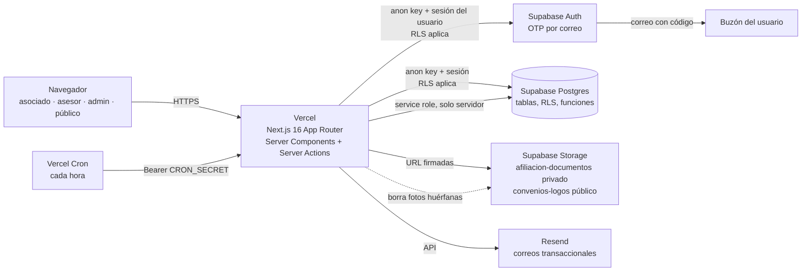
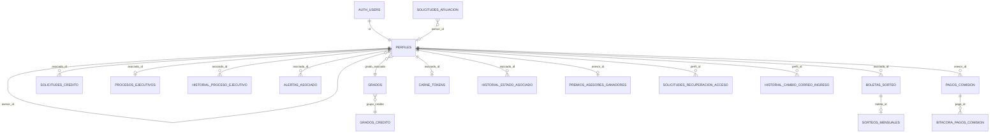

# Documentación técnica básica · Plataforma Green Alliance

Contrato de prestación de servicios Nº 001-2026 · Cláusula novena y Anexo Técnico Nº 1, §3 («Documentación técnica básica»).

| | |
|---|---|
| Contratante | COOPERATIVA GREEN ALLIANCE, NIT 902.103.335-7 |
| Contratista | SEBASTIÁN SANDOVAL |
| Sitio en producción | https://www.greenallianceco.com |
| Repositorio | https://github.com/GreenAllianceCoo/PagGreenAlliance (rama de producción: `main`) |
| Versión del documento | 1.0 · 2026-10-01 |

Este documento describe la plataforma tal como está en el repositorio a la fecha. La fuente de verdad siempre es el código: `supabase/migrations/` para la base de datos, `app/` y `lib/` para la aplicación.

---

## 1. Arquitectura



En texto:

```
Navegador ──HTTPS──> Vercel (Next.js 16)
                       ├── Supabase Auth ........ ingreso con cédula + código de un solo uso (OTP)
                       ├── Supabase Postgres .... datos; Row Level Security en todas las tablas
                       ├── Supabase Storage ..... fotos de afiliación (privado) y logos de convenios (público)
                       └── Resend ............... correos a asociados y avisos
Vercel Cron (cada hora) ──> /api/cron/limpiar-fotos (borra fotos huérfanas de afiliación)
```

### 1.1 Componentes

| Capa | Tecnología | Dónde está |
|---|---|---|
| Interfaz y servidor web | Next.js 16.3 (App Router, Server Actions), React 19.3, Tailwind CSS 3 | `app/`, `components/` |
| Lógica de negocio y validaciones | TypeScript + zod 4 | `lib/` (`lib/validaciones/` para los esquemas) |
| Protección de rutas | `proxy.ts` (exige sesión en `/cuenta`, `/asesor`, `/admin`; el rol lo valida cada página) | `proxy.ts` |
| Base de datos | Supabase Postgres, 56 migraciones versionadas | `supabase/migrations/` |
| Autenticación | Supabase Auth, código de 6 dígitos por correo, sin contraseñas | `lib/ingreso/`, `app/ingresar/` |
| Archivos | Supabase Storage | buckets `afiliacion-documentos` y `convenios-logos` |
| Correo | Resend (plantillas publicadas; si falta una, texto plano) | `lib/correo/`, `docs/resend-plantillas.md` |
| PDF y QR del carné | `pdf-lib`, `qrcode` | `lib/carnePdf.ts`, `lib/carneQr.ts` |
| Hosting y tareas programadas | Vercel (plan Pro), `vercel.json` | `vercel.json` |
| Pruebas | Vitest (unitarias), pgTAP (base de datos, 28 archivos), Playwright (punta a punta, escritorio y celular) | `tests/`, `supabase/tests/` |

### 1.2 Rutas principales

| Ruta | Quién | Qué hace |
|---|---|---|
| `/` | Público | Landing: misión, visión, servicios, convenios, contacto por WhatsApp |
| `/afiliacion` | Público | Formulario de afiliación con institución, grado, nómina, fotos del documento y selfie |
| `/politica-de-datos` | Público | Política de tratamiento de datos personales |
| `/verificar/<código>` | Público | Verificación del carné por QR, sin datos sensibles |
| `/ingresar`, `/ingresar/codigo` | Público | Ingreso en dos pasos: cédula y código enviado al correo |
| `/ingresar/recuperar` | Público | «¿Ya no tienes acceso a tu correo?»: pide a la cooperativa el cambio del correo de ingreso (no cambia nada por sí sola) |
| `/cuenta` y subrutas | Asociado | Estado del proceso, crédito, carné, sorteo, perfil (celular y cambio del correo de ingreso con código), retiro y renovación |
| `/asesor` | Asesor | Resumen, clientes (cédula enmascarada), comisiones, premios |
| `/admin` y subrutas | Administrador | Tablero, afiliaciones, asociados, créditos, asesores, sorteo, alertas, convenios |
| `/admin/demo`, `/asesor/demo` | Admin / asesor | Cuenta de demostración que no guarda datos (solo lee la tabla de cupos) |
| `/api/cron/limpiar-fotos` | Vercel Cron | Limpieza de fotos huérfanas |
| `/api/cuenta-inactiva` | Interno | Cierra la sesión de una cuenta dada de baja |

---

## 2. Roles y permisos

El rol vive en `public.perfiles.rol` (enum `rol_usuario`: `asociado`, `asesor`, `admin`). El usuario no puede cambiar su propio rol: lo impide el trigger `proteger_campos_perfil`.

| Capacidad | Asociado | Asesor | Administrador |
|---|:-:|:-:|:-:|
| Ver y editar su perfil (campos permitidos) | Sí | Sí | Sí |
| Solicitar microcrédito al 50 % o 100 % del cupo de su grado | Sí, solo con el proceso ejecutivo en «Operando» | No | No |
| Ver la tasa de interés | No | No | Sí |
| Carné virtual con QR y PDF | Sí | No | No |
| Inscribirse al sorteo mensual | Sí | No | No |
| Ver sus clientes y comisiones | No | Sí, cédula enmascarada, sin contacto, nómina ni fotos | Sí |
| Revisar afiliaciones y ver fotos (URL firmada de corta vida) | No | No | Sí |
| Aprobar o rechazar créditos, marcar desembolso, habilitar crédito tras rechazo | No | No | Sí |
| Proceso ejecutivo, baja y reactivación de asociados | No | No | Sí |
| Asesores, pagos de comisión, premios, sorteo, alertas, convenios | No | No | Sí |

**Cómo se crean los usuarios**

- **Asociado:** se crea cuando un administrador aprueba la afiliación en `/admin/afiliaciones` (`auth.admin.createUser`, con la cédula en `app_metadata`). El trigger `handle_new_user` crea el perfil y `sincronizar_perfil_desde_app_metadata` completa cédula y grado.
- **Asesor:** lo crea un administrador en `/admin/asesores`.
- **Administrador:** no hay pantalla para nombrar administradores, a propósito. Se asigna desde el editor SQL de Supabase, por quien tenga acceso de dueño al proyecto:
  ```sql
  update public.perfiles set rol = 'admin' where cedula = '<cédula>';
  ```
  Un administrador con `atiende_asociados = true` también puede tener clientes, como un asesor (función `puede_atender`).

---

## 3. Modelo de datos

Esquema `public` de Postgres. Todas las tablas tienen Row Level Security. Los nombres de columnas se citan tal como están en la base.

### 3.1 Diagrama de relaciones



### 3.2 Tablas

**Personas y afiliación**

| Tabla | Propósito | Columnas clave |
|---|---|---|
| `perfiles` | Un registro por usuario de Auth (asociado, asesor o admin) | `id` (= `auth.users.id`), `rol`, `cedula` (única), `nombre_completo`, `grado`, `grado_asociado` → `grados.codigo`, `institucion` (`policia`/`ejercito`), `telefono`, `correo_institucional`, `nomina_entidad`, `nomina_tipo`, `nomina_numero`, `asesor_id` → `perfiles`, `activo`, `atiende_asociados`, `avisar_apertura_sorteo` |
| `solicitudes_afiliacion` | Formulario público de afiliación | `nombres`, `apellidos`, `cedula`, `grado`, `institucion`, `celular`, `email` (correo personal), `correo_institucional` (dominio validado por institución), datos de nómina, `nequi`, `asesor_id`, `foto_cedula_frente`, `foto_cedula_reverso`, `foto_selfie` (rutas en Storage), `acepto_datos_at` y `version_politica_datos` (autorización Ley 1581 de 2012), `estado` (`pendiente`, `contactado`, `aprobada`, `rechazada`), `revisado_por`, `fecha_revision` |
| `historial_estado_asociado` | Bajas y reactivaciones (inmutable) | `asociado_id`, `activo_anterior`, `activo_nuevo`, `motivo` (5–300 caracteres), `admin_id` |

El correo personal del asociado **no** se guarda en `perfiles`: es el correo del usuario en Supabase Auth (una sola fuente).

**Grados y cupos**

| Tabla | Propósito | Columnas clave |
|---|---|---|
| `grados` | Catálogo de grados de Policía y Ejército | `codigo` (PK), `nombre`, `policia`, `ejercito`, `grupo_credito` (enlaza con el cupo), `orden`, `seleccionable` |
| `grados_credito` | Cupos definidos por la cooperativa (cláusula cuarta) | PK (`grado`, `porcentaje`), `capacidad_maxima`, `cuota_mensual`, `total_credito`, `plazo_meses`, `tasa_interes_mensual` (no visible para el asociado) |

Grupos de crédito (enum `grado_policial`): `PP`, `PT`, `SI`, `IT`, `IJ`, `CT`, `MY`, `TC`, `OF`.

**Crédito y proceso ejecutivo**

| Tabla | Propósito | Columnas clave |
|---|---|---|
| `solicitudes_credito` | Solicitudes de microcrédito | `asociado_id`, `grado`, `porcentaje_devolucion` (`50`/`100`), `monto_solicitado`, `cuota_mensual`, `plazo_meses`, `tasa_interes_mensual`, `estado` (`pendiente`, `aprobado`, `rechazado`), `motivo_rechazo`, `revisado_por`, `fecha_solicitud` (la fija el servidor), `fecha_respuesta`, `fecha_desembolso`, `desembolsado_por` |
| `procesos_ejecutivos` | Estado del proceso ejecutivo de cada asociado | `asociado_id` (PK), `estado` (8 pasos: `reparto`, `admitido`, `notificacion`, `sentencia`, `liquidacion`, `entrega_titulos`, `operando`, `terminado`), `fecha_inicio_embargo` (obligatoria en «operando») |
| `historial_proceso_ejecutivo` | Cada cambio de estado del proceso | `estado_anterior`, `estado_nuevo`, `fecha_inicio_embargo`, `admin_id` |
| `historial_solicitudes` | Historial y notas internas de afiliaciones y créditos (incluye «crédito habilitado tras rechazo»; inmutable) | `entidad`, `entidad_id`, `actor_id`, `accion`, `detalle` |
| `alertas_asociado` | Alertas de retiro anticipado y renovación para el admin | `tipo` (`retiro_anticipado`, `renovacion`), `estado` (`pendiente`, `atendida`), `atendida_por`, `atendida_at` |

**Recuperación de acceso** (migración `20261002500000_recuperacion_acceso`)

| Tabla | Propósito | Columnas clave |
|---|---|---|
| `solicitudes_recuperacion_acceso` | Pedidos de «ya no tengo acceso a mi correo» hechos sin sesión desde `/ingresar/recuperar`; solo los lee el admin. Una sola pendiente por persona | `perfil_id`, `cedula`, `correo_nuevo`, `celular`, `celular_coincide`, `motivo`, `estado` (`pendiente`, `atendida`, `rechazada`), `resuelta_por`, `resuelta_at`, `motivo_resolucion` |
| `historial_cambio_correo_ingreso` | Quién cambió el correo de ingreso de quién, cuándo y por qué. No guarda los correos (viven solo en `auth.users`) | `perfil_id`, `actor_id`, `origen` (`admin`, `asociado`), `motivo`, `solicitud_id` |

**Asesores y comisiones**

| Tabla | Propósito | Columnas clave |
|---|---|---|
| `pagos_comision` | Pagos registrados a asesores, con corte el día 15 | `asesor_id`, `asociado_id`, `periodo_corte` (siempre día 15), `concepto` (`ingreso_nuevo`, `embargo_operativo`, `bono_50_embargos`, `viaje_100_embargos`, `ajuste`), `monto`, `nota`, `anulado`, `anulado_por`, `motivo_anulacion` |
| `bitacora_pagos_comision` | Bitácora inmutable de creación, edición y anulación de pagos | `pago_id`, `accion`, `antes`, `despues` (jsonb), `motivo`, `actor_id` |
| `revelaciones_acumulado_comision` | Cuántas veces el asesor consultó su acumulado | `asesor_id`, `veces`, `primera_at`, `ultima_at` |
| `premios_asesores_ganadores` | Primer asesor que llega a 50 (bono) y a 100 (viaje) asociados | `meta` (50/100, PK), `asesor_id`, `clientes_al_ganar`, `alcanzado_at` |
| `premios_asesores_clics` | Registro de toques en la sección de premios | `asesor_id`, `meta`, `created_at` |

**Sorteo mensual**

| Tabla | Propósito | Columnas clave |
|---|---|---|
| `boletas_sorteo` | Boleta de cada asociado por mes | `asociado_id`, `anio`, `mes`, `numero` (6 dígitos, oculto hasta confirmar), `estado` (`enviada`, `confirmada`), `intentos` |
| `sorteos_mensuales` | Resultado del sorteo de cada mes (inmutable) | `mes` (PK, día 1), `boleta_id`, `asociado_id`, `participantes`, `realizado_por` |

**Convenios, carné y soporte**

| Tabla | Propósito | Columnas clave |
|---|---|---|
| `convenios` | Empresas aliadas administrables desde `/admin/convenios` | `nombre_empresa`, `nit`, `sector`, `especialidad`, `descripcion`, `servicios[]`, `sedes[]`, `telefono_contacto`, `logo_path` (bucket `convenios-logos`), `video_url`, `pdf_url`, `orden`, `visible`, `activo` |
| `carne_tokens` | Código aleatorio del QR del carné (se puede regenerar) | `asociado_id` (PK), `token` (uuid único), `rotado_at` |
| `limites_intentos` | Contador de intentos para limitar abuso (clave HMAC, no guarda la cédula ni la IP en claro) | `clave`, `creado_at` |

### 3.3 Funciones (RPC) relevantes

Las acciones sensibles pasan por funciones `security definer` que validan el rol dentro de la base, no solo en la aplicación.

| Grupo | Funciones |
|---|---|
| Rol y acceso | `es_admin`, `es_asesor`, `puede_atender` |
| Ingreso | `correo_por_cedula` (solo service role), `registrar_intento` |
| Recuperación de acceso | `crear_solicitud_recuperacion` y `registrar_cambio_correo_propio` (solo service role), `admin_registrar_cambio_correo`, `admin_rechazar_recuperacion` |
| Crédito | `validar_monto_solicitud` (trigger: tope del grado), `exigir_proceso_operando_credito`, `exigir_asociado_activo`, `tabla_credito_con_tasa`, `admin_tasas_solicitudes`, `admin_marcar_desembolsado`, `admin_habilitar_credito`, `mi_habilitacion_credito` |
| Proceso ejecutivo y bajas | `admin_actualizar_proceso_ejecutivo`, `mi_proceso_ejecutivo`, `admin_cambiar_estado_asociado` |
| Alertas | `crear_alerta_asociado`, `admin_marcar_alerta_atendida`, `correos_admins` |
| Asesores | `resumen_clientes_asesor`, `buscar_cliente_asesor`, `enmascarar_cedula`, `comisiones_periodo_asesor`, `periodo_comision`, `revelar_acumulado_comision`, `bonos_acumulados_asesor`, `admin_editar_pago_comision`, `admin_anular_pago_comision`, `obtener_asesores_publico` |
| Premios | `evaluar_premios_asesor`, `mis_premios_asesor`, `admin_premios_asesores`, `registrar_clic_premios` |
| Sorteo | `participar_sorteo`, `confirmar_boleta_sorteo`, `mi_boleta_sorteo`, `sorteo_ventana_abierta`, `boletas_confirmadas_sorteo`, `admin_inscritos_sorteo`, `admin_realizar_sorteo`, `ganador_sorteo_vigente` |
| Carné | `mi_carne_token`, `regenerar_carne_token`, `verificar_carne` (pública, devuelve solo datos no sensibles) |
| Métricas | `admin_metricas_dashboard`, `asesor_metricas_dashboard` |
| Afiliación y política | `validar_grado_afiliacion`, `validar_dominio_correo_afiliacion`, `dominios_correo_institucional`, `version_politica_datos_vigente`, `fotos_huerfanas_afiliacion` |
| Integridad (triggers) | `proteger_campos_perfil`, `sellar_revision_solicitud`, `proteger_topes_con_pendientes`, `bitacora_inmutable`, `historial_estado_inmutable`, `sorteo_inmutable`, `log_historial_*` |

### 3.4 Storage

| Bucket | Acceso | Límite | Contenido |
|---|---|---|---|
| `afiliacion-documentos` | Privado. Se sube con URL firmada y un «ticket» HMAC que vence en 2 h; el admin ve las fotos con URL firmada de corta vida | 5 MB, JPEG/PNG/WebP | Cédula (frente y reverso) y selfie de cada afiliación |
| `convenios-logos` | Público (solo lectura) | 1 MB, PNG/JPEG/WebP (sin SVG) | Logos de los convenios |

---

## 4. Seguridad y privacidad

- **Row Level Security** en todas las tablas; las pruebas pgTAP (`supabase/tests/`) verifican qué ve cada rol.
- **Llave de servicio** (`SUPABASE_SERVICE_ROLE_KEY`) solo en el servidor (`lib/supabase/admin.ts` con `server-only`). Nunca llega al navegador.
- **Ingreso sin contraseñas:** cédula + código de 6 dígitos enviado al correo personal. La cookie entre el paso 1 y el 2 va cifrada con AES-256-GCM (`INGRESO_COOKIE_SECRET`).
- **Sin enumeración:** la respuesta del paso 1 es igual exista o no la cédula (correo enmascarado real o de relleno, mismo tiempo de respuesta).
- **Límites de intentos** (`lib/servidor/limite.ts`, clave HMAC en `limites_intentos`):
  - envío de código: 1 cada 45 s y 5 cada 15 min por cédula; 20 cada 15 min por IP;
  - verificación de código: 5 cada 15 min por cédula y 30 por IP;
  - afiliación: 3 por cédula al día, 5 por IP a la hora y 10 subidas de fotos por IP a la hora;
  - asesor: búsquedas y consultas de acumulado limitadas por hora; reenvío de la boleta del sorteo limitado por día;
  - recuperación de acceso: 2 solicitudes por cédula al día y 5 por IP a la hora; cambio de correo propio: 3 pedidos de código por persona a la hora (20 por IP) y 5 verificaciones cada 15 min; cambio de correo por un admin: 10 por hora.
- **Datos mínimos por rol:** el asociado no ve la tasa de interés; el asesor ve cédulas enmascaradas y no ve contacto, nómina ni fotos.
- **Correo institucional:** solo recibe un aviso sin datos personales.
- **Fotos de afiliación:** bucket privado; las huérfanas (más de 3 h sin solicitud) se borran cada hora.
- **Auditoría:** historiales y bitácoras inmutables (afiliación, crédito, proceso ejecutivo, bajas, pagos de comisión, sorteo) e historial de cambios del correo de ingreso.
- **Autorización de datos:** cada afiliación guarda fecha de aceptación y versión de la política (`/politica-de-datos`).
- **Carné:** el QR lleva un código aleatorio que se puede regenerar, no la cédula; `/verificar` solo muestra datos no sensibles.

### 4.1 Ingreso y recuperación de acceso

Como no hay contraseñas, no hay nada que «olvidar»: recuperar el acceso es pedir un código nuevo.

1. En `/ingresar` el asociado escribe su cédula; la plataforma le muestra su correo enmascarado y le envía un código de 6 dígitos.
2. Si el código no llega o venció, usa **«Reenviar código»** (disponible a los 45 s) o **«Cambiar cédula»** para empezar de nuevo.
3. Si la cuenta está dada de baja, al entrar ve el aviso «Tu cuenta está inactiva» y se le cierra la sesión.

**Cambio del correo de ingreso** (migración `20261002500000_recuperacion_acceso`; en el repositorio, **pendiente de aplicar en producción**):

4. **El asociado no cambia su correo por su cuenta** (decisión SEC-REC-02): `/cuenta/perfil` solo explica cómo pedirlo. El cambio existe únicamente por la vía de recuperación con administrador:
5. **Solicitud y cambio por admin** (`/ingresar/recuperar`): la persona deja cédula, correo nuevo, celular y motivo. La respuesta es siempre la misma (anti-enumeración) y la solicitud solo se crea para un asociado activo (`crear_solicitud_recuperacion`). Los administradores reciben un aviso por correo; en `/admin/alertas` o en la ficha del asociado verifican la identidad por fuera y usan «Cambiar correo de ingreso» (`auth.admin.updateUserById` con service role, y luego `admin_registrar_cambio_correo`) o «Rechazar» (`admin_rechazar_recuperacion`). Un admin no puede cambiar su propio correo ni el de sus clientes.

Los correos de asesores y administradores no tienen pantalla de cambio: se cambian en Supabase (**Authentication → Users**) por quien tenga acceso de dueño.

**Configuración en producción:** *Secure email change* queda **activo** (equivale a `double_confirm_changes = true` en `supabase/config.toml`) y no se pega ninguna plantilla de cambio de correo. Compensaciones (SEC-REC-02): un trigger sobre `auth.users` deja huella en `historial_cambio_correo_ingreso` (origen `auth`) de todo cambio de correo, incluso si se hace directo contra la API de Auth; conviene activar la notificación nativa «Email address changed» de Supabase (en `config.toml`: `[auth.email.notification.email_changed]`). El cambio hecho por un administrador valida primero (`admin_validar_cambio_correo`: solicitud pendiente, no es cliente suyo, sin cambio de asesor propio en 24 h), cierra todas las sesiones de la persona (`cerrar_sesiones_usuario`) y exige confirmar el celular del perfil cuando el escrito no coincide.

---

## 5. Variables de entorno

Se configuran en Vercel (**Settings → Environment Variables**). La plantilla con explicaciones está en `.env.example`. Aquí solo van los nombres; los valores nunca se escriben en documentos ni en el repositorio.

| Variable | Dónde se usa | Para qué |
|---|---|---|
| `NEXT_PUBLIC_SUPABASE_URL` | Navegador y servidor | URL del proyecto de Supabase |
| `NEXT_PUBLIC_SUPABASE_ANON_KEY` | Navegador y servidor | Llave pública; RLS aplica |
| `SUPABASE_SERVICE_ROLE_KEY` | Solo servidor | Operaciones administrativas (salta RLS) |
| `INGRESO_COOKIE_SECRET` | Solo servidor | Cifra la cookie entre los pasos del ingreso |
| `LIMITE_HMAC_SECRET` | Solo servidor | Claves de los límites de intentos y ticket de subida de fotos. Obligatoria: sin ella el build falla |
| `CRON_SECRET` | Solo servidor | Autoriza la tarea programada (32+ caracteres) |
| `RESEND_API_KEY` | Solo servidor | Envío de correos. Obligatoria |
| `EMAIL_FROM` | Solo servidor | Remitente verificado en Resend. Obligatoria |
| `RESEND_TEMPLATE_INGRESO_ACEPTADO`, `RESEND_TEMPLATE_CREDITO_APROBADO`, `RESEND_TEMPLATE_CREDITO_RECHAZADO`, `RESEND_TEMPLATE_SORTEO_BOLETA` | Solo servidor | Plantillas de Resend (la del sorteo es obligatoria) |
| `RESEND_TEMPLATE_CREDITO_DESEMBOLSADO`, `RESEND_TEMPLATE_SORTEO_GANADOR`, `RESEND_TEMPLATE_CREDITO_HABILITADO`, `RESEND_TEMPLATE_AVISO_INSTITUCIONAL`, `RESEND_TEMPLATE_CORREO_CAMBIADO` | Solo servidor | Plantillas opcionales; sin ellas se envía texto plano |
| `SITIO_URL` | Solo servidor | URL pública sin barra final, para los enlaces de los correos. Obligatoria en producción |
| `NEXT_PUBLIC_WHATSAPP` | Navegador | Número de WhatsApp de contacto (10 dígitos, sin +57) |

Para generar un secreto nuevo:

```bash
node -e "console.log(require('crypto').randomBytes(32).toString('base64url'))"
```

Cambiar `LIMITE_HMAC_SECRET` reinicia los contadores de intentos; cambiar `INGRESO_COOKIE_SECRET` obliga a quien esté a mitad del ingreso a empezar de nuevo. Ninguno de los dos borra datos.

**Configuración fuera de las variables:** en Supabase (**Authentication → URL Configuration**) el *Site URL* debe ser `https://www.greenallianceco.com`; el SMTP de Auth y la plantilla del código de ingreso (`supabase/templates/codigo-ingreso.html`) se configura en **Authentication → Emails**; *Secure email change* queda activo (ver §4.1). En Resend, el dominio del remitente debe estar verificado (registros DNS en el dominio).

---

## 6. Tareas programadas

| Tarea | Frecuencia | Qué hace |
|---|---|---|
| `/api/cron/limpiar-fotos` (Vercel Cron, `vercel.json`) | Cada hora (`0 * * * *`, requiere plan Pro de Vercel) | Borra del bucket `afiliacion-documentos` las fotos de más de 3 h que no pertenecen a ninguna solicitud. Exige `Authorization: Bearer <CRON_SECRET>`; sin él responde 401 y no hace nada |

No hay tareas en `pg_cron`. El sorteo, los cortes de comisión y las alertas se ejecutan por acción del usuario, no por calendario.

---

## 7. Cómo desplegar

**Flujo normal**

1. Trabajar en una rama y fusionar en `develop` (integración).
2. Si hay migraciones nuevas, **hacer un respaldo** (ver `respaldo-y-restauracion.md`) y aplicarlas en producción:
   ```bash
   npx supabase link --project-ref <ref del proyecto>
   npx supabase db push --linked
   ```
3. Fusionar `develop` en `main`. Vercel despliega `main` automáticamente.
4. Revisar el despliegue en Vercel (**Deployments**) y probar ingreso, afiliación y `/admin`.

**Antes de fusionar, en local:**

```bash
npm run lint
npx tsc --noEmit
npm run test:unit
npm run test:db                                         # requiere Supabase local (Docker)
npx playwright test -c tests/e2e/playwright.config.ts
```

**Volver atrás:** en Vercel, **Deployments → (versión anterior) → Promote to Production** restaura el código al instante. Las migraciones de base de datos no se deshacen solas: por eso el respaldo previo.

**Desarrollo local:** ver `README.md` (Node 20+, Docker, `npx supabase start`, `npx supabase db reset`, `npm run dev`).

---

## 8. Continuidad con otro proveedor (cláusula vigésima octava)

La plataforma está hecha para que otra persona o empresa la pueda continuar sin depender del contratista:

- **Código:** repositorio Git completo, en la organización de GitHub de la cooperativa, con historial.
- **Base de datos:** todo el esquema está en `supabase/migrations/`, en orden. Un proyecto nuevo de Supabase se reconstruye con `npx supabase db push`; los datos se llevan con el procedimiento de `respaldo-y-restauracion.md`.
- **Tecnologías estándar y documentadas:** Next.js, React, Postgres, TypeScript. Sin componentes propietarios del contratista.
- **Sin dependencia de un proveedor único:**
  - Vercel se puede reemplazar por cualquier servicio que ejecute Next.js (`npm run build && npm run start` con Node 20+). La tarea programada se reemplaza por cualquier cron que llame a `/api/cron/limpiar-fotos` con el encabezado `Authorization: Bearer <CRON_SECRET>`.
  - Supabase es Postgres estándar; el esquema y los datos se exportan con `pg_dump`/`supabase db dump`. Auth y Storage son las partes más ligadas a Supabase.
  - Resend se puede cambiar por otro proveedor de correo modificando solo `lib/correo/resend.ts`.
- **Documentación para el siguiente equipo:** este documento, `README.md`, `docs/entrega/manual-administracion.md` (qué hace cada botón del panel; `docs/mapa-de-botones.md` está desactualizado y no debe usarse como referencia), `docs/resend-plantillas.md`, `docs/spec-requerimientos-ricardo-2026-09-29.md` (reglas de negocio) y las pruebas automáticas, que describen el comportamiento esperado.
- **Accesos:** el inventario y la lista de transferencia están en `anexo-2-cuentas-y-accesos.md`.
